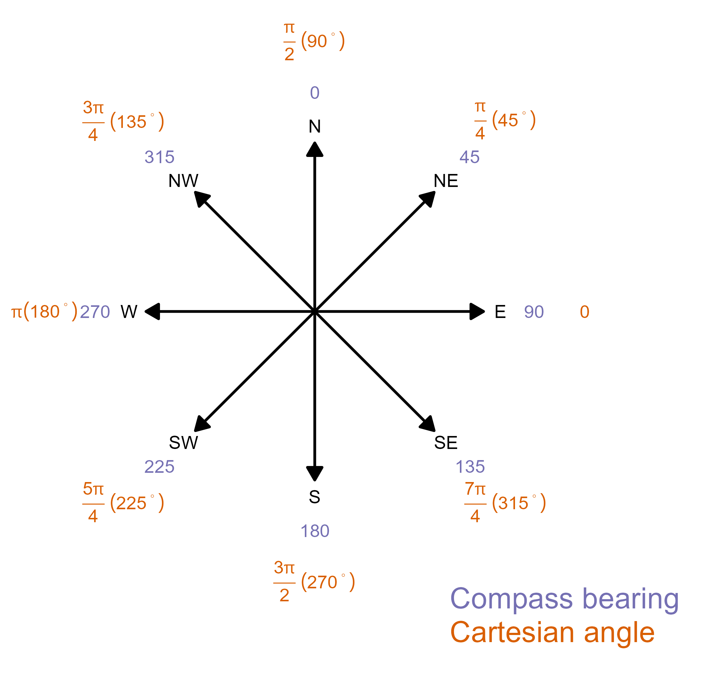

<!-- README.md is generated from README.Rmd. Please edit that file -->

```{r, include = FALSE}
knitr::opts_chunk$set(
  collapse = TRUE,
  comment = "#>",
  fig.path = "man/figures/README-",
  out.width = "100%"
)
```

# compassutils

<!-- badges: start -->
[](https://github.com/mbedward/compassutils/actions/workflows/R-CMD-check.yaml)

[](https://github.com/mbedward/compassutils/actions/workflows/test-coverage.yaml)
<!-- badges: end -->

R package for working with map and compass bearings. 

This package tries to help avoid the potential confusion between compass and Cartesian angles when working with spatial data. Compass angles (commonly referred to as compass bearings), define 0 degrees as north and positive angles proceed clockwise. In contrast, Cartesian angles define zero as the direction of the positive X-axis and angles proceed anti-clockwise. Compass angles are almost always expressed in degrees while Cartesian angles are generally expressed in radians. 

The standard trigonometric functions in R such as `sin`, `cos` and `atan2` assume you are working with Cartesian angles expressed in radians.

**Terrible things happen when you confuse these two systems!**



To help keep me (and you) safe from such things this package provides functions to convert between compass and Cartesian angles, as well as other map- and compass-related tasks such as finding the bearing from one point to another, locating a point that lies at a given distance and bearing from a reference point, and testing whether a bearing lies within a specified angular range.

The package is primarily intended for use at the Centre for Environmental Risk Management of Bushfire, University of Wollongong. Everyone is welcome to use it but please treat it as a very early work-in-progress. Any or all code is liable to change without notice in the 0.x versions.


## Installation

You can install the development version of compassutils from [GitHub](https://github.com/) with:

``` r
# install.packages("remotes")
remotes::install_github("mbedward/compassutils")
```

## Some examples

Convert Cartesian angles in radians to the corresponding compass bearings in degrees.

``` r
library(compassutils)

cartesian_angles <- seq(0, 2*pi, pi/3)

compass_bearings <- cartesian2compass(cartesian_angles, degrees = FALSE) |> rad2deg()
```

Find the compass bearing from a reference point location to each of a set of
other points. The `get_compass_bearing` function can work with point coordinates
provided as simple vectors and matrices, or with point features using the `sf`
package.

``` r
# The reference point
p0 <- c(700000, 6530000)

# A query point to the north-west of p0
p1 <- c(695000, 6535000)

get_compass_bearing(p0, p1)  # returns 315 degrees

# If the two points are the same there is no valid bearing
get_compass_bearing(p0, p0)  # returns NA

```

Get the coordinates of a point at a given distance and compass bearing from a reference point.

``` r
# The reference point
p0 <- c(305170, 6190800)

# Find the target point 170 metres from the reference point along a compass
# bearing of 10 degrees (slightly east of north)
#
ptarget <- get_target_point(p0, bearing = 10, distance = 170, degrees = TRUE)
cat("Target point coordinates:", ptarget)

```

