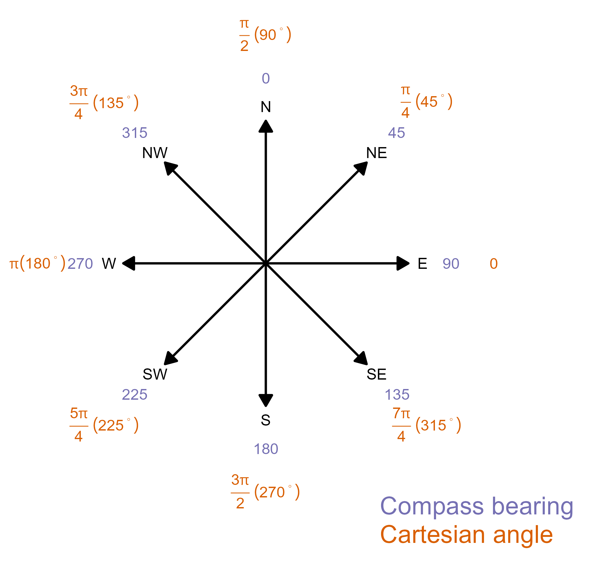

<!-- README.md is generated from README.Rmd. Please edit that file -->

# compassutils

<!-- badges: start -->

[](https://github.com/mbedward/compassutils/actions/workflows/R-CMD-check.yaml)

[](https://github.com/mbedward/compassutils/actions/workflows/test-coverage.yaml)
<!-- badges: end -->

This package provides some simple functions for working with map and
compass bearings. In particular, it tries to help avoid confusion
between compass bearings, where 0 degrees is north and positive angles
proceed clockwise, and Cartesian angles where zero is the direction of
the positive X-axis and angles proceed anti-clockwise. Compass bearings
are used with map and metereological (e.g. wind direction) and are 
generally expressed as values in degrees, whereas R's trigonometric 
functions such as `sin`, `cos`, `atan2` work with Cartesian angles expressed
in radians.



**Terrible things happen when you confuse these two systems!**

To help keep me (and you) safe from such things this package provides
functions to convert between compass and Cartesian angles expressed as
degrees or radians. There are additional functions for common tasks
such as finding the compass bearing from one point to another, and testing
whether a bearing lies within a specified angular range (useful when 
working with wind direction data).

The package is intended for use by myself and colleagues at the
Centre for Environmental Risk Management of Bushfire, University of
Wollongong. Everyone is free to use it but please treat it as a very
early work-in-progress, and beware that any and all code is liable to
change in the 0.x versions. Suggestions, bug reports and pull requests
are very welcome.

## Installation

You can install the development version of compassutils from
[GitHub](https://github.com/) with:

``` r
# install.packages("devtools")
devtools::install_github("mbedward/compassutils")
```

## Some examples

Convert Cartesian angles in radians to the corresponding compass
bearings in degrees.

``` r
library(compassutils)

cartesian_angles <- seq(0, 2*pi, pi/3)

compass_bearings <- cartesian2compass(cartesian_angles, degrees = FALSE) |> rad2deg()
```

Find the compass bearing from a reference point location to each of a
set of other points. The `get_compass_bearing` function can work with
point coordinates provided as simple vectors and matrices, or with point
features using the `sf` package.

``` r
# The reference point
p0 <- c(700000, 6530000)

# A query point to the north-west of p0
p1 <- c(695000, 6535000)

get_compass_bearing(p0, p1)  # returns 315 degrees

# If the two points are the same there is no valid bearing
get_compass_bearing(p0, p0)  # returns NA
```
